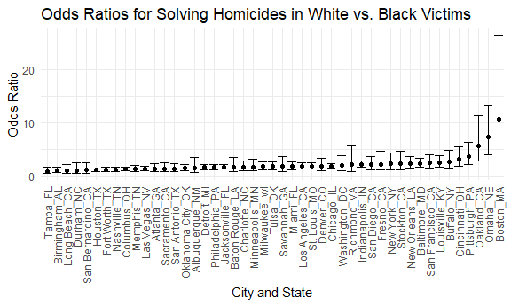

Homework 6
================
Jessica Flynn

``` r
library(tidyverse)
```

    ## -- Attaching packages --------------------------------------- tidyverse 1.3.0 --

    ## v ggplot2 3.3.2     v purrr   0.3.4
    ## v tibble  3.0.3     v dplyr   1.0.2
    ## v tidyr   1.1.2     v stringr 1.4.0
    ## v readr   1.3.1     v forcats 0.5.0

    ## -- Conflicts ------------------------------------------ tidyverse_conflicts() --
    ## x dplyr::filter() masks stats::filter()
    ## x dplyr::lag()    masks stats::lag()

``` r
library(p8105.datasets)
library(modelr)

set.seed(1)


theme_set(theme_minimal() + theme(legend.position = "bottom"))

options(
  ggplot2.continuous.colour = "viridis",
  ggplot2.continuous.fill = "viridis"
)

scale_colour_discrete = scale_colour_viridis_d
scale_fill_discrete = scale_fill_viridis_d

knitr::opts_chunk$set(
  fig.width = 6,
  fig.asp = .6,
  out.width = "90%"
)
```

## Problem 1

``` r
##change unknown to NA for sex

homicide_df = 
  read_csv("data/homicide-data.csv", na = c("", "NA", "Unknown")) %>% 
  mutate( 
    city_state = str_c(city, state, sep = "_"),
    victim_age = as.numeric(victim_age),
    resolved = case_when(
      disposition == "Closed without arrest" ~ 0, 
      disposition =="Open/No arrest" ~ 0, 
      disposition == "Closed by arrest" ~ 1)
    ) %>%
  filter(victim_race %in% c("White", "Black"),
         city_state != "Tulsa_AL", 
         city_state != "Dallas_TX", 
         city_state != "Phoenix_AZ", 
         city_state != "Kansas City_MO") %>%
  select(city_state, resolved, victim_age, victim_race, victim_sex)
```

    ## Parsed with column specification:
    ## cols(
    ##   uid = col_character(),
    ##   reported_date = col_double(),
    ##   victim_last = col_character(),
    ##   victim_first = col_character(),
    ##   victim_race = col_character(),
    ##   victim_age = col_double(),
    ##   victim_sex = col_character(),
    ##   city = col_character(),
    ##   state = col_character(),
    ##   lat = col_double(),
    ##   lon = col_double(),
    ##   disposition = col_character()
    ## )

Start with one city.

``` r
baltimore_df = 
  homicide_df %>% 
  filter(city_state == "Baltimore_MD")


baltimore_model = 
  glm(resolved ~ victim_age + victim_race + victim_sex,
    data = baltimore_df, 
    family = binomial()) %>% 
  broom::tidy() %>% 
  mutate(
    OR = exp(estimate), 
    CI_lower = exp(estimate - 1.96*std.error), 
    CI_upper = exp(estimate + 1.96*std.error)
  ) %>% 
  select(term, OR, starts_with("CI"))

baltimore_model %>% 
  knitr::kable(digits = 3)
```

| term              |    OR | CI\_lower | CI\_upper |
| :---------------- | ----: | --------: | --------: |
| (Intercept)       | 1.363 |     0.975 |     1.907 |
| victim\_age       | 0.993 |     0.987 |     1.000 |
| victim\_raceWhite | 2.320 |     1.648 |     3.268 |
| victim\_sexMale   | 0.426 |     0.325 |     0.558 |

The estimate of the adjusted odds ratio for solving homicides comparing
non-white victims to white victims keeping all other variables fixed is
2.32 and the confidence interval is (1.648, 3.268)

Try this across cities.

``` r
model_results_df =
  homicide_df %>% 
  nest(data = -city_state) %>% 
  mutate(models = map(.x = data, ~glm(resolved ~ victim_age + victim_race + victim_sex, data = .x, family = binomial())), 
         results = map(models, broom::tidy)) %>% 
  select(city_state, results) %>% 
  unnest(results) %>% 
  mutate(
    OR = exp(estimate), 
    CI_lower = exp(estimate - 1.96*std.error), 
    CI_upper = exp(estimate + 1.96*std.error)
  ) %>% 
  select(city_state, term, OR, starts_with("CI"))
```

``` r
model_results_df %>% 
  filter(term == "victim_raceWhite") %>%
  mutate(city_state = fct_reorder(city_state, OR)) %>%
  ggplot(aes(x = city_state, y = OR)) + 
  geom_point() + 
  geom_errorbar(aes(ymin = CI_lower, ymax = CI_upper)) +
  theme(axis.text.x =  element_text(angle = 90, vjust = 0.5, hjust = 1))
```



This plot shows that for all cities, the OR is above 1 for the odds of
solving homicides for white victims compared to black victims. In
Boston, MA, this OR is the largest with the odds of a crime being solved
for a white victim at over 10 times the odds of it being solves for a
black victim.

## Problem 2

When building own model, check for significance, check residuals \* For
resids, x = resid, add density plot- see if normal (no skew) \* Plot x =
ga\_weeks, y= resid and look if outlier

``` r
birth_df = 
  read_csv("data/birthweight.csv", na = c("", "NA", "Unknown")) %>% 
  mutate(babysex = case_when(babysex == 1 ~ "male", 
                             babysex == 2 ~ "female"), 
         malform = case_when(malform == 0 ~ "absent", 
                             malform == 1 ~ "present")) %>% 
  mutate_at(
    vars(contains("race")), 
    funs(case_when(
      . == 1 ~ "white", 
      . == 2 ~"black", 
      . == 3 ~ "asian",
      . == 4 ~ "puerto rican", 
      . == 8 ~ "other", 
      . == 9 ~ "unknown")))
```

    ## Parsed with column specification:
    ## cols(
    ##   .default = col_double()
    ## )

    ## See spec(...) for full column specifications.

    ## Warning: `funs()` is deprecated as of dplyr 0.8.0.
    ## Please use a list of either functions or lambdas: 
    ## 
    ##   # Simple named list: 
    ##   list(mean = mean, median = median)
    ## 
    ##   # Auto named with `tibble::lst()`: 
    ##   tibble::lst(mean, median)
    ## 
    ##   # Using lambdas
    ##   list(~ mean(., trim = .2), ~ median(., na.rm = TRUE))
    ## This warning is displayed once every 8 hours.
    ## Call `lifecycle::last_warnings()` to see where this warning was generated.

## Problem 3
