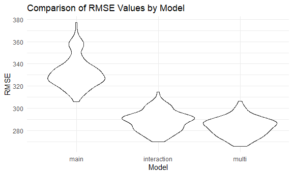

Homework 6
================
Jessica Flynn

``` r
library(tidyverse)
```

    ## -- Attaching packages --------------------------------------- tidyverse 1.3.0 --

    ## v ggplot2 3.3.2     v purrr   0.3.4
    ## v tibble  3.0.3     v dplyr   1.0.2
    ## v tidyr   1.1.2     v stringr 1.4.0
    ## v readr   1.3.1     v forcats 0.5.0

    ## -- Conflicts ------------------------------------------ tidyverse_conflicts() --
    ## x dplyr::filter() masks stats::filter()
    ## x dplyr::lag()    masks stats::lag()

``` r
library(p8105.datasets)
library(modelr)
library(gtsummary)
```

    ## Warning: package 'gtsummary' was built under R version 4.0.3

``` r
set.seed(1)


theme_set(theme_minimal() + theme(legend.position = "bottom"))

options(
  ggplot2.continuous.colour = "viridis",
  ggplot2.continuous.fill = "viridis"
)

scale_colour_discrete = scale_colour_viridis_d
scale_fill_discrete = scale_fill_viridis_d

knitr::opts_chunk$set(
  fig.width = 6,
  fig.asp = .6,
  out.width = "90%"
  )
```

## Problem 1

``` r
homicide_df = 
  read_csv("data/homicide-data.csv", na = c("", "NA", "Unknown")) %>% 
  mutate( 
    city_state = str_c(city, state, sep = "_"),
    victim_age = as.numeric(victim_age),
    resolved = case_when(
      disposition == "Closed without arrest" ~ 0, 
      disposition =="Open/No arrest" ~ 0, 
      disposition == "Closed by arrest" ~ 1)) %>%
  filter(victim_race %in% c("White", "Black"),
         city_state != "Tulsa_AL", 
         city_state != "Dallas_TX", 
         city_state != "Phoenix_AZ", 
         city_state != "Kansas City_MO") %>%
  select(city_state, resolved, victim_age, victim_race, victim_sex)
```

    ## Parsed with column specification:
    ## cols(
    ##   uid = col_character(),
    ##   reported_date = col_double(),
    ##   victim_last = col_character(),
    ##   victim_first = col_character(),
    ##   victim_race = col_character(),
    ##   victim_age = col_double(),
    ##   victim_sex = col_character(),
    ##   city = col_character(),
    ##   state = col_character(),
    ##   lat = col_double(),
    ##   lon = col_double(),
    ##   disposition = col_character()
    ## )

Start with one city.

``` r
baltimore_df = 
  homicide_df %>% 
  filter(city_state == "Baltimore_MD")


baltimore_model = 
  glm(resolved ~ victim_age + victim_race + victim_sex,
    data = baltimore_df, 
    family = binomial()) %>% 
  broom::tidy() %>% 
  mutate(
    OR = exp(estimate), 
    CI_lower = exp(estimate - 1.96*std.error), 
    CI_upper = exp(estimate + 1.96*std.error)) %>% 
  select(term, OR, starts_with("CI"))

baltimore_model %>% 
  knitr::kable(digits = 3)
```

| term              |    OR | CI\_lower | CI\_upper |
| :---------------- | ----: | --------: | --------: |
| (Intercept)       | 1.363 |     0.975 |     1.907 |
| victim\_age       | 0.993 |     0.987 |     1.000 |
| victim\_raceWhite | 2.320 |     1.648 |     3.268 |
| victim\_sexMale   | 0.426 |     0.325 |     0.558 |

The estimate of the adjusted odds ratio for solving homicides comparing
non-white victims to white victims keeping all other variables fixed is
2.32 and the confidence interval is (1.648, 3.268)

Try this across cities.

``` r
model_results_df =
  homicide_df %>% 
  nest(data = -city_state) %>% 
  mutate(models = map(.x = data, ~glm(resolved ~ victim_age + victim_race + victim_sex, data = .x, family = binomial())), 
         results = map(models, broom::tidy)) %>% 
  select(city_state, results) %>% 
  unnest(results) %>% 
  mutate(
    OR = exp(estimate), 
    CI_lower = exp(estimate - 1.96*std.error), 
    CI_upper = exp(estimate + 1.96*std.error)) %>% 
  select(city_state, term, OR, starts_with("CI")) %>% 
  print()
```

    ## # A tibble: 188 x 5
    ##    city_state     term                OR CI_lower CI_upper
    ##    <chr>          <chr>            <dbl>    <dbl>    <dbl>
    ##  1 Albuquerque_NM (Intercept)      1.84     0.534    6.37 
    ##  2 Albuquerque_NM victim_age       0.981    0.963    0.998
    ##  3 Albuquerque_NM victim_raceWhite 1.51     0.668    3.41 
    ##  4 Albuquerque_NM victim_sexMale   1.77     0.831    3.76 
    ##  5 Atlanta_GA     (Intercept)      2.39     1.49     3.83 
    ##  6 Atlanta_GA     victim_age       0.988    0.979    0.997
    ##  7 Atlanta_GA     victim_raceWhite 1.31     0.749    2.28 
    ##  8 Atlanta_GA     victim_sexMale   1.00     0.684    1.46 
    ##  9 Baltimore_MD   (Intercept)      1.36     0.975    1.91 
    ## 10 Baltimore_MD   victim_age       0.993    0.987    1.00 
    ## # ... with 178 more rows

``` r
model_results_df %>% 
  filter(term == "victim_raceWhite") %>%
  mutate(city_state = fct_reorder(city_state, OR)) %>%
  ggplot(aes(x = city_state, y = OR)) + 
  geom_point() + 
  geom_errorbar(aes(ymin = CI_lower, ymax = CI_upper)) +
  theme(axis.text.x =  element_text(angle = 90, vjust = 0.5, hjust = 1))
```


This plot shows that for all cities, the OR is above 1 for the odds of
solving homicides for white victims compared to black victims. In
Boston, MA, this OR is the largest with the odds of a crime being solved
for a white victim at over 10 times the odds of it being solves for a
black victim.

## Problem 2

``` r
birth_df = 
  read_csv("data/birthweight.csv", na = c("", "NA", "Unknown")) %>% 
  mutate(babysex = case_when(babysex == 1 ~ "male", 
                             babysex == 2 ~ "female"), 
         malform = case_when(malform == 0 ~ "absent", 
                             malform == 1 ~ "present")) %>% 
  mutate_at(
    vars(contains("race")), 
    funs(case_when(
      . == 1 ~ "white", 
      . == 2 ~"black", 
      . == 3 ~ "asian",
      . == 4 ~ "puerto rican", 
      . == 8 ~ "other", 
      . == 9 ~ "unknown")))
```

    ## Parsed with column specification:
    ## cols(
    ##   .default = col_double()
    ## )

    ## See spec(...) for full column specifications.

    ## Warning: `funs()` is deprecated as of dplyr 0.8.0.
    ## Please use a list of either functions or lambdas: 
    ## 
    ##   # Simple named list: 
    ##   list(mean = mean, median = median)
    ## 
    ##   # Auto named with `tibble::lst()`: 
    ##   tibble::lst(mean, median)
    ## 
    ##   # Using lambdas
    ##   list(~ mean(., trim = .2), ~ median(., na.rm = TRUE))
    ## This warning is displayed once every 8 hours.
    ## Call `lifecycle::last_warnings()` to see where this warning was generated.

Next, we will build a model to predict `bwt`, the child’s birthweight.
The first step in this modeling process will be to look at which
variables alone are significant predictors of birthweight. This is
referred to as univariable analysis. We will conduct this for all
variables and use `bwt` as the outcome.

``` r
tbl_uvregression(birth_df, 
                 method = lm, 
                 y = bwt)
```

<!--html_preserve-->

<style>html {
  font-family: -apple-system, BlinkMacSystemFont, 'Segoe UI', Roboto, Oxygen, Ubuntu, Cantarell, 'Helvetica Neue', 'Fira Sans', 'Droid Sans', Arial, sans-serif;
}

#ydgabwknrs .gt_table {
  display: table;
  border-collapse: collapse;
  margin-left: auto;
  margin-right: auto;
  color: #333333;
  font-size: 16px;
  font-weight: normal;
  font-style: normal;
  background-color: #FFFFFF;
  width: auto;
  border-top-style: solid;
  border-top-width: 2px;
  border-top-color: #A8A8A8;
  border-right-style: none;
  border-right-width: 2px;
  border-right-color: #D3D3D3;
  border-bottom-style: solid;
  border-bottom-width: 2px;
  border-bottom-color: #A8A8A8;
  border-left-style: none;
  border-left-width: 2px;
  border-left-color: #D3D3D3;
}

#ydgabwknrs .gt_heading {
  background-color: #FFFFFF;
  text-align: center;
  border-bottom-color: #FFFFFF;
  border-left-style: none;
  border-left-width: 1px;
  border-left-color: #D3D3D3;
  border-right-style: none;
  border-right-width: 1px;
  border-right-color: #D3D3D3;
}

#ydgabwknrs .gt_title {
  color: #333333;
  font-size: 125%;
  font-weight: initial;
  padding-top: 4px;
  padding-bottom: 4px;
  border-bottom-color: #FFFFFF;
  border-bottom-width: 0;
}

#ydgabwknrs .gt_subtitle {
  color: #333333;
  font-size: 85%;
  font-weight: initial;
  padding-top: 0;
  padding-bottom: 4px;
  border-top-color: #FFFFFF;
  border-top-width: 0;
}

#ydgabwknrs .gt_bottom_border {
  border-bottom-style: solid;
  border-bottom-width: 2px;
  border-bottom-color: #D3D3D3;
}

#ydgabwknrs .gt_col_headings {
  border-top-style: solid;
  border-top-width: 2px;
  border-top-color: #D3D3D3;
  border-bottom-style: solid;
  border-bottom-width: 2px;
  border-bottom-color: #D3D3D3;
  border-left-style: none;
  border-left-width: 1px;
  border-left-color: #D3D3D3;
  border-right-style: none;
  border-right-width: 1px;
  border-right-color: #D3D3D3;
}

#ydgabwknrs .gt_col_heading {
  color: #333333;
  background-color: #FFFFFF;
  font-size: 100%;
  font-weight: normal;
  text-transform: inherit;
  border-left-style: none;
  border-left-width: 1px;
  border-left-color: #D3D3D3;
  border-right-style: none;
  border-right-width: 1px;
  border-right-color: #D3D3D3;
  vertical-align: bottom;
  padding-top: 5px;
  padding-bottom: 6px;
  padding-left: 5px;
  padding-right: 5px;
  overflow-x: hidden;
}

#ydgabwknrs .gt_column_spanner_outer {
  color: #333333;
  background-color: #FFFFFF;
  font-size: 100%;
  font-weight: normal;
  text-transform: inherit;
  padding-top: 0;
  padding-bottom: 0;
  padding-left: 4px;
  padding-right: 4px;
}

#ydgabwknrs .gt_column_spanner_outer:first-child {
  padding-left: 0;
}

#ydgabwknrs .gt_column_spanner_outer:last-child {
  padding-right: 0;
}

#ydgabwknrs .gt_column_spanner {
  border-bottom-style: solid;
  border-bottom-width: 2px;
  border-bottom-color: #D3D3D3;
  vertical-align: bottom;
  padding-top: 5px;
  padding-bottom: 6px;
  overflow-x: hidden;
  display: inline-block;
  width: 100%;
}

#ydgabwknrs .gt_group_heading {
  padding: 8px;
  color: #333333;
  background-color: #FFFFFF;
  font-size: 100%;
  font-weight: initial;
  text-transform: inherit;
  border-top-style: solid;
  border-top-width: 2px;
  border-top-color: #D3D3D3;
  border-bottom-style: solid;
  border-bottom-width: 2px;
  border-bottom-color: #D3D3D3;
  border-left-style: none;
  border-left-width: 1px;
  border-left-color: #D3D3D3;
  border-right-style: none;
  border-right-width: 1px;
  border-right-color: #D3D3D3;
  vertical-align: middle;
}

#ydgabwknrs .gt_empty_group_heading {
  padding: 0.5px;
  color: #333333;
  background-color: #FFFFFF;
  font-size: 100%;
  font-weight: initial;
  border-top-style: solid;
  border-top-width: 2px;
  border-top-color: #D3D3D3;
  border-bottom-style: solid;
  border-bottom-width: 2px;
  border-bottom-color: #D3D3D3;
  vertical-align: middle;
}

#ydgabwknrs .gt_from_md > :first-child {
  margin-top: 0;
}

#ydgabwknrs .gt_from_md > :last-child {
  margin-bottom: 0;
}

#ydgabwknrs .gt_row {
  padding-top: 8px;
  padding-bottom: 8px;
  padding-left: 5px;
  padding-right: 5px;
  margin: 10px;
  border-top-style: solid;
  border-top-width: 1px;
  border-top-color: #D3D3D3;
  border-left-style: none;
  border-left-width: 1px;
  border-left-color: #D3D3D3;
  border-right-style: none;
  border-right-width: 1px;
  border-right-color: #D3D3D3;
  vertical-align: middle;
  overflow-x: hidden;
}

#ydgabwknrs .gt_stub {
  color: #333333;
  background-color: #FFFFFF;
  font-size: 100%;
  font-weight: initial;
  text-transform: inherit;
  border-right-style: solid;
  border-right-width: 2px;
  border-right-color: #D3D3D3;
  padding-left: 12px;
}

#ydgabwknrs .gt_summary_row {
  color: #333333;
  background-color: #FFFFFF;
  text-transform: inherit;
  padding-top: 8px;
  padding-bottom: 8px;
  padding-left: 5px;
  padding-right: 5px;
}

#ydgabwknrs .gt_first_summary_row {
  padding-top: 8px;
  padding-bottom: 8px;
  padding-left: 5px;
  padding-right: 5px;
  border-top-style: solid;
  border-top-width: 2px;
  border-top-color: #D3D3D3;
}

#ydgabwknrs .gt_grand_summary_row {
  color: #333333;
  background-color: #FFFFFF;
  text-transform: inherit;
  padding-top: 8px;
  padding-bottom: 8px;
  padding-left: 5px;
  padding-right: 5px;
}

#ydgabwknrs .gt_first_grand_summary_row {
  padding-top: 8px;
  padding-bottom: 8px;
  padding-left: 5px;
  padding-right: 5px;
  border-top-style: double;
  border-top-width: 6px;
  border-top-color: #D3D3D3;
}

#ydgabwknrs .gt_striped {
  background-color: rgba(128, 128, 128, 0.05);
}

#ydgabwknrs .gt_table_body {
  border-top-style: solid;
  border-top-width: 2px;
  border-top-color: #D3D3D3;
  border-bottom-style: solid;
  border-bottom-width: 2px;
  border-bottom-color: #D3D3D3;
}

#ydgabwknrs .gt_footnotes {
  color: #333333;
  background-color: #FFFFFF;
  border-bottom-style: none;
  border-bottom-width: 2px;
  border-bottom-color: #D3D3D3;
  border-left-style: none;
  border-left-width: 2px;
  border-left-color: #D3D3D3;
  border-right-style: none;
  border-right-width: 2px;
  border-right-color: #D3D3D3;
}

#ydgabwknrs .gt_footnote {
  margin: 0px;
  font-size: 90%;
  padding: 4px;
}

#ydgabwknrs .gt_sourcenotes {
  color: #333333;
  background-color: #FFFFFF;
  border-bottom-style: none;
  border-bottom-width: 2px;
  border-bottom-color: #D3D3D3;
  border-left-style: none;
  border-left-width: 2px;
  border-left-color: #D3D3D3;
  border-right-style: none;
  border-right-width: 2px;
  border-right-color: #D3D3D3;
}

#ydgabwknrs .gt_sourcenote {
  font-size: 90%;
  padding: 4px;
}

#ydgabwknrs .gt_left {
  text-align: left;
}

#ydgabwknrs .gt_center {
  text-align: center;
}

#ydgabwknrs .gt_right {
  text-align: right;
  font-variant-numeric: tabular-nums;
}

#ydgabwknrs .gt_font_normal {
  font-weight: normal;
}

#ydgabwknrs .gt_font_bold {
  font-weight: bold;
}

#ydgabwknrs .gt_font_italic {
  font-style: italic;
}

#ydgabwknrs .gt_super {
  font-size: 65%;
}

#ydgabwknrs .gt_footnote_marks {
  font-style: italic;
  font-size: 65%;
}
</style>

<div id="ydgabwknrs" style="overflow-x:auto;overflow-y:auto;width:auto;height:auto;">

<table class="gt_table">

<thead class="gt_col_headings">

<tr>

<th class="gt_col_heading gt_columns_bottom_border gt_left" rowspan="1" colspan="1">

<strong>Characteristic</strong>

</th>

<th class="gt_col_heading gt_columns_bottom_border gt_center" rowspan="1" colspan="1">

<strong>N</strong>

</th>

<th class="gt_col_heading gt_columns_bottom_border gt_center" rowspan="1" colspan="1">

<strong>Beta</strong>

</th>

<th class="gt_col_heading gt_columns_bottom_border gt_center" rowspan="1" colspan="1">

<strong>95% CI</strong><sup class="gt_footnote_marks">1</sup>

</th>

<th class="gt_col_heading gt_columns_bottom_border gt_center" rowspan="1" colspan="1">

<strong>p-value</strong>

</th>

</tr>

</thead>

<tbody class="gt_table_body">

<tr>

<td class="gt_row gt_left">

babysex

</td>

<td class="gt_row gt_center">

4,342

</td>

<td class="gt_row gt_center">

</td>

<td class="gt_row gt_center">

</td>

<td class="gt_row gt_center">

</td>

</tr>

<tr>

<td class="gt_row gt_left" style="text-align: left; text-indent: 10px;">

female

</td>

<td class="gt_row gt_center">

</td>

<td class="gt_row gt_center">

—

</td>

<td class="gt_row gt_center">

—

</td>

<td class="gt_row gt_center">

</td>

</tr>

<tr>

<td class="gt_row gt_left" style="text-align: left; text-indent: 10px;">

male

</td>

<td class="gt_row gt_center">

</td>

<td class="gt_row gt_center">

89

</td>

<td class="gt_row gt_center">

58, 119

</td>

<td class="gt_row gt_center">

\<0.001

</td>

</tr>

<tr>

<td class="gt_row gt_left">

bhead

</td>

<td class="gt_row gt_center">

4,342

</td>

<td class="gt_row gt_center">

236

</td>

<td class="gt_row gt_center">

230, 242

</td>

<td class="gt_row gt_center">

\<0.001

</td>

</tr>

<tr>

<td class="gt_row gt_left">

blength

</td>

<td class="gt_row gt_center">

4,342

</td>

<td class="gt_row gt_center">

140

</td>

<td class="gt_row gt_center">

136, 144

</td>

<td class="gt_row gt_center">

\<0.001

</td>

</tr>

<tr>

<td class="gt_row gt_left">

delwt

</td>

<td class="gt_row gt_center">

4,342

</td>

<td class="gt_row gt_center">

6.6

</td>

<td class="gt_row gt_center">

6.0, 7.3

</td>

<td class="gt_row gt_center">

\<0.001

</td>

</tr>

<tr>

<td class="gt_row gt_left">

fincome

</td>

<td class="gt_row gt_center">

4,342

</td>

<td class="gt_row gt_center">

3.0

</td>

<td class="gt_row gt_center">

2.5, 3.6

</td>

<td class="gt_row gt_center">

\<0.001

</td>

</tr>

<tr>

<td class="gt_row gt_left">

frace

</td>

<td class="gt_row gt_center">

4,342

</td>

<td class="gt_row gt_center">

</td>

<td class="gt_row gt_center">

</td>

<td class="gt_row gt_center">

</td>

</tr>

<tr>

<td class="gt_row gt_left" style="text-align: left; text-indent: 10px;">

asian

</td>

<td class="gt_row gt_center">

</td>

<td class="gt_row gt_center">

—

</td>

<td class="gt_row gt_center">

—

</td>

<td class="gt_row gt_center">

</td>

</tr>

<tr>

<td class="gt_row gt_left" style="text-align: left; text-indent: 10px;">

black

</td>

<td class="gt_row gt_center">

</td>

<td class="gt_row gt_center">

\-208

</td>

<td class="gt_row gt_center">

\-351, -65

</td>

<td class="gt_row gt_center">

0.004

</td>

</tr>

<tr>

<td class="gt_row gt_left" style="text-align: left; text-indent: 10px;">

other

</td>

<td class="gt_row gt_center">

</td>

<td class="gt_row gt_center">

17

</td>

<td class="gt_row gt_center">

\-276, 310

</td>

<td class="gt_row gt_center">

> 0.9
> 
> </td>
> 
> </tr>
> 
> <tr>
> 
> <td class="gt_row gt_left" style="text-align: left; text-indent: 10px;">
> 
> puerto rican
> 
> </td>
> 
> <td class="gt_row gt_center">
> 
> </td>
> 
> <td class="gt_row gt_center">
> 
> \-98
> 
> </td>
> 
> <td class="gt_row gt_center">
> 
> \-252, 56
> 
> </td>
> 
> <td class="gt_row gt_center">
> 
> 0.2
> 
> </td>
> 
> </tr>
> 
> <tr>
> 
> <td class="gt_row gt_left" style="text-align: left; text-indent: 10px;">
> 
> white
> 
> </td>
> 
> <td class="gt_row gt_center">
> 
> </td>
> 
> <td class="gt_row gt_center">
> 
> 106
> 
> </td>
> 
> <td class="gt_row gt_center">
> 
> \-37, 249
> 
> </td>
> 
> <td class="gt_row gt_center">
> 
> 0.15
> 
> </td>
> 
> </tr>
> 
> <tr>
> 
> <td class="gt_row gt_left">
> 
> gaweeks
> 
> </td>
> 
> <td class="gt_row gt_center">
> 
> 4,342
> 
> </td>
> 
> <td class="gt_row gt_center">
> 
> 67
> 
> </td>
> 
> <td class="gt_row gt_center">
> 
> 63, 71
> 
> </td>
> 
> <td class="gt_row gt_center">
> 
> \<0.001
> 
> </td>
> 
> </tr>
> 
> <tr>
> 
> <td class="gt_row gt_left">
> 
> malform
> 
> </td>
> 
> <td class="gt_row gt_center">
> 
> 4,342
> 
> </td>
> 
> <td class="gt_row gt_center">
> 
> </td>
> 
> <td class="gt_row gt_center">
> 
> </td>
> 
> <td class="gt_row gt_center">
> 
> </td>
> 
> </tr>
> 
> <tr>
> 
> <td class="gt_row gt_left" style="text-align: left; text-indent: 10px;">
> 
> absent
> 
> </td>
> 
> <td class="gt_row gt_center">
> 
> </td>
> 
> <td class="gt_row gt_center">
> 
> —
> 
> </td>
> 
> <td class="gt_row gt_center">
> 
> —
> 
> </td>
> 
> <td class="gt_row gt_center">
> 
> </td>
> 
> </tr>
> 
> <tr>
> 
> <td class="gt_row gt_left" style="text-align: left; text-indent: 10px;">
> 
> present
> 
> </td>
> 
> <td class="gt_row gt_center">
> 
> </td>
> 
> <td class="gt_row gt_center">
> 
> 12
> 
> </td>
> 
> <td class="gt_row gt_center">
> 
> \-248, 271
> 
> </td>
> 
> <td class="gt_row gt_center">
> 
> > 0.9
> > 
> > </td>
> > 
> > </tr>
> > 
> > <tr>
> > 
> > <td class="gt_row gt_left">
> > 
> > menarche
> > 
> > </td>
> > 
> > <td class="gt_row gt_center">
> > 
> > 4,342
> > 
> > </td>
> > 
> > <td class="gt_row gt_center">
> > 
> > \-8.5
> > 
> > </td>
> > 
> > <td class="gt_row gt_center">
> > 
> > \-19, 1.8
> > 
> > </td>
> > 
> > <td class="gt_row gt_center">
> > 
> > 0.11
> > 
> > </td>
> > 
> > </tr>
> > 
> > <tr>
> > 
> > <td class="gt_row gt_left">
> > 
> > mheight
> > 
> > </td>
> > 
> > <td class="gt_row gt_center">
> > 
> > 4,342
> > 
> > </td>
> > 
> > <td class="gt_row gt_center">
> > 
> > 37
> > 
> > </td>
> > 
> > <td class="gt_row gt_center">
> > 
> > 31, 43
> > 
> > </td>
> > 
> > <td class="gt_row gt_center">
> > 
> > \<0.001
> > 
> > </td>
> > 
> > </tr>
> > 
> > <tr>
> > 
> > <td class="gt_row gt_left">
> > 
> > momage
> > 
> > </td>
> > 
> > <td class="gt_row gt_center">
> > 
> > 4,342
> > 
> > </td>
> > 
> > <td class="gt_row gt_center">
> > 
> > 18
> > 
> > </td>
> > 
> > <td class="gt_row gt_center">
> > 
> > 14, 22
> > 
> > </td>
> > 
> > <td class="gt_row gt_center">
> > 
> > \<0.001
> > 
> > </td>
> > 
> > </tr>
> > 
> > <tr>
> > 
> > <td class="gt_row gt_left">
> > 
> > mrace
> > 
> > </td>
> > 
> > <td class="gt_row gt_center">
> > 
> > 4,342
> > 
> > </td>
> > 
> > <td class="gt_row gt_center">
> > 
> > </td>
> > 
> > <td class="gt_row gt_center">
> > 
> > </td>
> > 
> > <td class="gt_row gt_center">
> > 
> > </td>
> > 
> > </tr>
> > 
> > <tr>
> > 
> > <td class="gt_row gt_left" style="text-align: left; text-indent: 10px;">
> > 
> > asian
> > 
> > </td>
> > 
> > <td class="gt_row gt_center">
> > 
> > </td>
> > 
> > <td class="gt_row gt_center">
> > 
> > —
> > 
> > </td>
> > 
> > <td class="gt_row gt_center">
> > 
> > —
> > 
> > </td>
> > 
> > <td class="gt_row gt_center">
> > 
> > </td>
> > 
> > </tr>
> > 
> > <tr>
> > 
> > <td class="gt_row gt_left" style="text-align: left; text-indent: 10px;">
> > 
> > black
> > 
> > </td>
> > 
> > <td class="gt_row gt_center">
> > 
> > </td>
> > 
> > <td class="gt_row gt_center">
> > 
> > \-190
> > 
> > </td>
> > 
> > <td class="gt_row gt_center">
> > 
> > \-338, -42
> > 
> > </td>
> > 
> > <td class="gt_row gt_center">
> > 
> > 0.012
> > 
> > </td>
> > 
> > </tr>
> > 
> > <tr>
> > 
> > <td class="gt_row gt_left" style="text-align: left; text-indent: 10px;">
> > 
> > puerto rican
> > 
> > </td>
> > 
> > <td class="gt_row gt_center">
> > 
> > </td>
> > 
> > <td class="gt_row gt_center">
> > 
> > \-85
> > 
> > </td>
> > 
> > <td class="gt_row gt_center">
> > 
> > \-243, 74
> > 
> > </td>
> > 
> > <td class="gt_row gt_center">
> > 
> > 0.3
> > 
> > </td>
> > 
> > </tr>
> > 
> > <tr>
> > 
> > <td class="gt_row gt_left" style="text-align: left; text-indent: 10px;">
> > 
> > white
> > 
> > </td>
> > 
> > <td class="gt_row gt_center">
> > 
> > </td>
> > 
> > <td class="gt_row gt_center">
> > 
> > 126
> > 
> > </td>
> > 
> > <td class="gt_row gt_center">
> > 
> > \-21, 274
> > 
> > </td>
> > 
> > <td class="gt_row gt_center">
> > 
> > 0.093
> > 
> > </td>
> > 
> > </tr>
> > 
> > <tr>
> > 
> > <td class="gt_row gt_left">
> > 
> > parity
> > 
> > </td>
> > 
> > <td class="gt_row gt_center">
> > 
> > 4,342
> > 
> > </td>
> > 
> > <td class="gt_row gt_center">
> > 
> > \-42
> > 
> > </td>
> > 
> > <td class="gt_row gt_center">
> > 
> > \-190, 106
> > 
> > </td>
> > 
> > <td class="gt_row gt_center">
> > 
> > 0.6
> > 
> > </td>
> > 
> > </tr>
> > 
> > <tr>
> > 
> > <td class="gt_row gt_left">
> > 
> > pnumlbw
> > 
> > </td>
> > 
> > <td class="gt_row gt_center">
> > 
> > 4,342
> > 
> > </td>
> > 
> > <td class="gt_row gt_center">
> > 
> > </td>
> > 
> > <td class="gt_row gt_center">
> > 
> > </td>
> > 
> > <td class="gt_row gt_center">
> > 
> > </td>
> > 
> > </tr>
> > 
> > <tr>
> > 
> > <td class="gt_row gt_left">
> > 
> > pnumsga
> > 
> > </td>
> > 
> > <td class="gt_row gt_center">
> > 
> > 4,342
> > 
> > </td>
> > 
> > <td class="gt_row gt_center">
> > 
> > </td>
> > 
> > <td class="gt_row gt_center">
> > 
> > </td>
> > 
> > <td class="gt_row gt_center">
> > 
> > </td>
> > 
> > </tr>
> > 
> > <tr>
> > 
> > <td class="gt_row gt_left">
> > 
> > ppbmi
> > 
> > </td>
> > 
> > <td class="gt_row gt_center">
> > 
> > 4,342
> > 
> > </td>
> > 
> > <td class="gt_row gt_center">
> > 
> > 15
> > 
> > </td>
> > 
> > <td class="gt_row gt_center">
> > 
> > 10, 20
> > 
> > </td>
> > 
> > <td class="gt_row gt_center">
> > 
> > \<0.001
> > 
> > </td>
> > 
> > </tr>
> > 
> > <tr>
> > 
> > <td class="gt_row gt_left">
> > 
> > ppwt
> > 
> > </td>
> > 
> > <td class="gt_row gt_center">
> > 
> > 4,342
> > 
> > </td>
> > 
> > <td class="gt_row gt_center">
> > 
> > 4.6
> > 
> > </td>
> > 
> > <td class="gt_row gt_center">
> > 
> > 3.9, 5.4
> > 
> > </td>
> > 
> > <td class="gt_row gt_center">
> > 
> > \<0.001
> > 
> > </td>
> > 
> > </tr>
> > 
> > <tr>
> > 
> > <td class="gt_row gt_left">
> > 
> > smoken
> > 
> > </td>
> > 
> > <td class="gt_row gt_center">
> > 
> > 4,342
> > 
> > </td>
> > 
> > <td class="gt_row gt_center">
> > 
> > \-5.2
> > 
> > </td>
> > 
> > <td class="gt_row gt_center">
> > 
> > \-7.3, -3.2
> > 
> > </td>
> > 
> > <td class="gt_row gt_center">
> > 
> > \<0.001
> > 
> > </td>
> > 
> > </tr>
> > 
> > <tr>
> > 
> > <td class="gt_row gt_left">
> > 
> > wtgain
> > 
> > </td>
> > 
> > <td class="gt_row gt_center">
> > 
> > 4,342
> > 
> > </td>
> > 
> > <td class="gt_row gt_center">
> > 
> > 12
> > 
> > </td>
> > 
> > <td class="gt_row gt_center">
> > 
> > 10, 13
> > 
> > </td>
> > 
> > <td class="gt_row gt_center">
> > 
> > \<0.001
> > 
> > </td>
> > 
> > </tr>
> > 
> > </tbody>

<tfoot>

<tr class="gt_footnotes">

<td colspan="5">

<p class="gt_footnote">

<sup class="gt_footnote_marks"> <em>1</em> </sup>

CI = Confidence Interval <br />

</p>

</td>

</tr>

</tfoot>

</table>

</div>

<!--/html_preserve-->

From the univariable analysis, we see that many variables are
significant predictors of bwt. A few of these variables are likely to be
highly correlated. For example, `ppbmi` (mother’s pre-pregnancy BMI) and
`ppwt` (mother’s pre-pregnancy weight) and are similar measures,
Additionally, `delwt`(mother’s weight at delivery) is likely highly
correlated with `ppbmi`, as is `mheight`(mother’s height). Delivery
weight is also likely correlated with `ppwt` and `wtgain`(mother’s
weight gain during pregnancy).

Since `ppbmi` has height and weight information, we will use only this
and not all of the potentially correlated variables (`ppwt`, `delwt`,
`mheight`, `wtgain`)

`pnumlbw` and `pnumsga` are both columns of all 0 values, so not beta
was able to be estimated.

Since only Black vs Asian is significant for both `mrace` and `frace`
and all levels are not significant, we will not include these variables
in the multivariable model.

Now, we will put all of the remaining significant variables into a
multivariable model.

``` r
model_multi = lm(bwt ~ babysex + bhead + blength + fincome  + gaweeks  + momage  + ppbmi + smoken, data = birth_df)

model_multi %>% 
  broom::tidy() %>% 
  knitr::kable(digits = 3)
```

| term        |   estimate | std.error | statistic | p.value |
| :---------- | ---------: | --------: | --------: | ------: |
| (Intercept) | \-6263.779 |    99.044 |  \-63.243 |   0.000 |
| babysexmale |   \-33.080 |     8.771 |   \-3.772 |   0.000 |
| bhead       |    137.701 |     3.552 |    38.772 |   0.000 |
| blength     |     81.242 |     2.066 |    39.328 |   0.000 |
| fincome     |      1.100 |     0.176 |     6.241 |   0.000 |
| gaweeks     |     13.446 |     1.509 |     8.911 |   0.000 |
| momage      |      3.766 |     1.183 |     3.184 |   0.001 |
| ppbmi       |      3.421 |     1.362 |     2.512 |   0.012 |
| smoken      |    \-2.249 |     0.586 |   \-3.836 |   0.000 |

All of the variables in our model are independently significant
predictions of baby’s birthweight. Now, we will plot of fitted values vs
residuals. Below, we see that the majority of the resdiuals hover around
0, and that there is no obvious pattern in the residuals, however, there
are some extreme residuals which may be a concern.

``` r
birth_df %>% 
  add_residuals(model_multi) %>% 
  add_predictions(model_multi) %>% 
  ggplot(aes(x = pred, y = resid)) + 
  geom_point() + 
  labs(x = "Fitted Values", 
         y = "Residuals")
```


Model comparison using `crossv_mc` for cross validation

``` r
model_main = lm(bwt ~ blength + gaweeks, data = birth_df)
model_interaction = lm(bwt ~ bhead * blength * babysex, data = birth_df)

cv_df = 
  crossv_mc(birth_df, 100) 

cv_df =
  cv_df %>% 
  mutate(
    train = map(train, as_tibble),
    test = map(test, as_tibble))

cv_df = 
  cv_df %>% 
  mutate(
    model_main  = map(train, ~lm(bwt ~ blength + gaweeks, data = .x)),
    model_interaction = map(train, ~lm(bwt ~ bhead * blength * babysex, data = .x)),
    model_multi  = map(train, ~lm(bwt~ babysex + bhead + blength + fincome  + gaweeks  + momage  + ppbmi + smoken, data = .x))) %>% 
  mutate(
    rmse_main = map2_dbl(model_main, test, ~rmse(model = .x, data = .y)),
    rmse_interaction = map2_dbl(model_interaction, test, ~rmse(model = .x, data = .y)),
    rmse_multi = map2_dbl(model_multi, test, ~rmse(model = .x, data = .y)))
```

Compare RSMEs

``` r
cv_df %>% 
  select(starts_with("rmse")) %>% 
  pivot_longer(
    everything(),
    names_to = "model", 
    values_to = "rmse",
    names_prefix = "rmse_") %>% 
  mutate(model = fct_inorder(model)) %>% 
  ggplot(aes(x = model, y = rmse)) + 
  geom_violin()
```



Looking at the RSME plot, we see that the model with the lowest RMSE is
the model we created, although, it may not have a sigificantly lower
RMSE than the interaction model. We would have to think carefully about
which model to choose – the interaciton model is more complicated to
interpret, but our model has more covariates.

## Problem 3

``` r
weather_df = 
  rnoaa::meteo_pull_monitors(
    c("USW00094728"),
    var = c("PRCP", "TMIN", "TMAX"), 
    date_min = "2017-01-01",
    date_max = "2017-12-31") %>%
  mutate(
    name = recode(id, USW00094728 = "CentralPark_NY"),
    tmin = tmin / 10,
    tmax = tmax / 10) %>%
  select(name, id, everything())
```

    ## Registered S3 method overwritten by 'hoardr':
    ##   method           from
    ##   print.cache_info httr

    ## using cached file: C:\Users\jessi\AppData\Local\Cache/R/noaa_ghcnd/USW00094728.dly

    ## date created (size, mb): 2020-09-30 19:36:26 (7.535)

    ## file min/max dates: 1869-01-01 / 2020-09-30

We will create the 5,000 bootstrap samples from the weather data

``` r
boot_straps = 
  weather_df %>% 
  modelr::bootstrap(n = 5000)
```

Now, we will run a linear model on each bootstrapped sample and extract
the relevant information we need (r-squared and log(beta0 \* beta1))

``` r
bootstrap_results = 
  boot_straps %>% 
  mutate(
    models = map(strap, ~lm(tmax ~ tmin, data = .x) ),
    results = map(models, broom::glance), 
    results2 = map(models, broom::tidy)) %>% 
  select(-strap, -models) %>% 
  unnest(c(results, results2), names_repair = "universal") %>% 
  select(.id, term, estimate, r.squared) %>% 
  pivot_wider(id_cols = c(.id, r.squared),
              names_from = term,
              values_from = estimate) %>% 
  rename(b0 = `(Intercept)`, 
         b1 = "tmin") %>% 
  mutate(logb0b1 = log(b0 * b1)) 
```

    ## New names:
    ## * statistic -> statistic...5
    ## * p.value -> p.value...6
    ## * statistic -> statistic...17
    ## * p.value -> p.value...18

Looking at the plots below, we see that both r-squared and log(b0\*b1)
are both normally distributed. The means and 95% confidence intervals
for each quantity are also provided.

``` r
bootstrap_results %>% 
  ggplot(aes(x = r.squared)) + 
  geom_histogram() +
  labs(x = "R-squared",
       y = "Count",
       title = "Distribution of R-squared")
```

    ## `stat_bin()` using `bins = 30`. Pick better value with `binwidth`.


``` r
bootstrap_results %>% 
  ggplot(aes(x = logb0b1)) + 
  geom_histogram() +
  labs(x = "log(beta0 * beta1)",
       y = "Count",
       title = "Distribution of log(beta0 * beta1)")
```

    ## `stat_bin()` using `bins = 30`. Pick better value with `binwidth`.


``` r
bootstrap_results %>% 
  select(-b0, -b1) %>% 
  pivot_longer(r.squared:logb0b1, 
               names_to = "term", 
               values_to = "estimate") %>%
  group_by(term) %>% 
  summarize(
    mean = mean(estimate),
    ci_lower = quantile(estimate, 0.025), 
    ci_upper = quantile(estimate, 0.975)) %>% 
  knitr::kable(digits = 3)
```

    ## `summarise()` ungrouping output (override with `.groups` argument)

| term      |  mean | ci\_lower | ci\_upper |
| :-------- | ----: | --------: | --------: |
| logb0b1   | 2.013 |     1.967 |     2.059 |
| r.squared | 0.911 |     0.894 |     0.927 |
