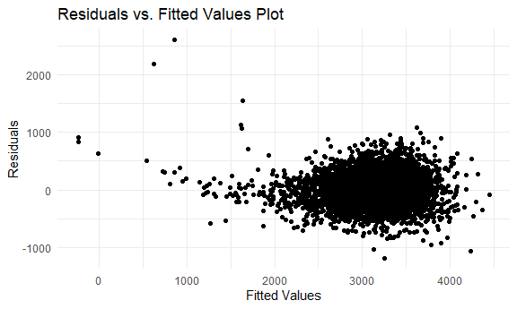

Homework 6
================
Jessica Flynn

``` r
library(tidyverse)
```

    ## -- Attaching packages --------------------------------------- tidyverse 1.3.0 --

    ## v ggplot2 3.3.2     v purrr   0.3.4
    ## v tibble  3.0.3     v dplyr   1.0.2
    ## v tidyr   1.1.2     v stringr 1.4.0
    ## v readr   1.3.1     v forcats 0.5.0

    ## -- Conflicts ------------------------------------------ tidyverse_conflicts() --
    ## x dplyr::filter() masks stats::filter()
    ## x dplyr::lag()    masks stats::lag()

``` r
library(p8105.datasets)
library(modelr)
library(gtsummary)
```

    ## Warning: package 'gtsummary' was built under R version 4.0.3

``` r
library(huxtable)
```

    ## Warning: package 'huxtable' was built under R version 4.0.3

    ## 
    ## Attaching package: 'huxtable'

    ## The following object is masked from 'package:gtsummary':
    ## 
    ##     as_flextable

    ## The following object is masked from 'package:dplyr':
    ## 
    ##     add_rownames

    ## The following object is masked from 'package:ggplot2':
    ## 
    ##     theme_grey

``` r
set.seed(1)


theme_set(theme_minimal() + theme(legend.position = "bottom"))

options(
  ggplot2.continuous.colour = "viridis",
  ggplot2.continuous.fill = "viridis"
)

scale_colour_discrete = scale_colour_viridis_d
scale_fill_discrete = scale_fill_viridis_d

knitr::opts_chunk$set(
  fig.width = 6,
  fig.asp = .6,
  out.width = "90%"
  )
```

## Problem 1

``` r
homicide_df = 
  read_csv("data/homicide-data.csv", na = c("", "NA", "Unknown")) %>% 
  mutate( 
    city_state = str_c(city, state, sep = "_"),
    victim_age = as.numeric(victim_age),
    resolved = case_when(
      disposition == "Closed without arrest" ~ 0, 
      disposition =="Open/No arrest" ~ 0, 
      disposition == "Closed by arrest" ~ 1)) %>%
  filter(victim_race %in% c("White", "Black"),
         city_state != "Tulsa_AL", 
         city_state != "Dallas_TX", 
         city_state != "Phoenix_AZ", 
         city_state != "Kansas City_MO") %>%
  select(city_state, resolved, victim_age, victim_race, victim_sex)
```

    ## Parsed with column specification:
    ## cols(
    ##   uid = col_character(),
    ##   reported_date = col_double(),
    ##   victim_last = col_character(),
    ##   victim_first = col_character(),
    ##   victim_race = col_character(),
    ##   victim_age = col_double(),
    ##   victim_sex = col_character(),
    ##   city = col_character(),
    ##   state = col_character(),
    ##   lat = col_double(),
    ##   lon = col_double(),
    ##   disposition = col_character()
    ## )

Start with one city.

``` r
baltimore_df = 
  homicide_df %>% 
  filter(city_state == "Baltimore_MD")


baltimore_model = 
  glm(resolved ~ victim_age + victim_race + victim_sex,
    data = baltimore_df, 
    family = binomial()) %>% 
  broom::tidy() %>% 
  mutate(
    OR = exp(estimate), 
    CI_lower = exp(estimate - 1.96*std.error), 
    CI_upper = exp(estimate + 1.96*std.error)) %>% 
  select(term, OR, starts_with("CI"))

baltimore_model %>% 
  knitr::kable(digits = 3)
```

| term              |    OR | CI\_lower | CI\_upper |
| :---------------- | ----: | --------: | --------: |
| (Intercept)       | 1.363 |     0.975 |     1.907 |
| victim\_age       | 0.993 |     0.987 |     1.000 |
| victim\_raceWhite | 2.320 |     1.648 |     3.268 |
| victim\_sexMale   | 0.426 |     0.325 |     0.558 |

The estimate of the adjusted odds ratio for solving homicides comparing
white victims to black victims keeping all other variables fixed is 2.32
and the confidence interval is (1.648, 3.268). This means that white
victims have significantly higher odds of their homicides being solved
compared to black victims in Baltimore.

Try this across cities.

``` r
model_results_df =
  homicide_df %>% 
  nest(data = -city_state) %>% 
  mutate(models = map(.x = data, ~glm(resolved ~ victim_age + victim_race + victim_sex, data = .x, family = binomial())), 
         results = map(models, broom::tidy)) %>% 
  select(city_state, results) %>% 
  unnest(results) %>% 
  mutate(
    OR = exp(estimate), 
    CI_lower = exp(estimate - 1.96*std.error), 
    CI_upper = exp(estimate + 1.96*std.error)) %>% 
  select(city_state, term, OR, starts_with("CI")) %>% 
  print()
```

    ## # A tibble: 188 x 5
    ##    city_state     term                OR CI_lower CI_upper
    ##    <chr>          <chr>            <dbl>    <dbl>    <dbl>
    ##  1 Albuquerque_NM (Intercept)      1.84     0.534    6.37 
    ##  2 Albuquerque_NM victim_age       0.981    0.963    0.998
    ##  3 Albuquerque_NM victim_raceWhite 1.51     0.668    3.41 
    ##  4 Albuquerque_NM victim_sexMale   1.77     0.831    3.76 
    ##  5 Atlanta_GA     (Intercept)      2.39     1.49     3.83 
    ##  6 Atlanta_GA     victim_age       0.988    0.979    0.997
    ##  7 Atlanta_GA     victim_raceWhite 1.31     0.749    2.28 
    ##  8 Atlanta_GA     victim_sexMale   1.00     0.684    1.46 
    ##  9 Baltimore_MD   (Intercept)      1.36     0.975    1.91 
    ## 10 Baltimore_MD   victim_age       0.993    0.987    1.00 
    ## # ... with 178 more rows

``` r
model_results_df %>% 
  filter(term == "victim_raceWhite") %>%
  mutate(city_state = fct_reorder(city_state, OR)) %>%
  ggplot(aes(x = city_state, y = OR)) + 
  geom_point() + 
  geom_errorbar(aes(ymin = CI_lower, ymax = CI_upper)) +
  theme(axis.text.x =  element_text(angle = 90, vjust = 0.5, hjust = 1)) + 
  labs(x = "City and State", 
       y = "Odds Ratio", 
       title = "Odds Ratios for Solving Homicides in White vs. Black Victims")
```


This plot shows that for most cities, the odds ratio appears to be above
one. An odds ratio above 1 means that the odds of solving homicides for
white victims is higher compared to solving homicides for black victims,
although it may not be significantly different depending on the
confidence intervals. In Boston, MA, this OR is the largest with the
odds of a crime being solved for a white victim at over 10 times the
odds of it being solves for a black victim.

## Problem 2

``` r
birth_df = 
  read_csv("data/birthweight.csv", na = c("", "NA", "Unknown")) %>% 
  mutate(babysex = case_when(babysex == 1 ~ "male", 
                             babysex == 2 ~ "female"), 
         malform = case_when(malform == 0 ~ "absent", 
                             malform == 1 ~ "present")) %>% 
  mutate_at(
    vars(contains("race")), 
    funs(case_when(
      . == 1 ~ "white", 
      . == 2 ~"black", 
      . == 3 ~ "asian",
      . == 4 ~ "puerto rican", 
      . == 8 ~ "other", 
      . == 9 ~ "unknown")))
```

    ## Parsed with column specification:
    ## cols(
    ##   .default = col_double()
    ## )

    ## See spec(...) for full column specifications.

    ## Warning: `funs()` is deprecated as of dplyr 0.8.0.
    ## Please use a list of either functions or lambdas: 
    ## 
    ##   # Simple named list: 
    ##   list(mean = mean, median = median)
    ## 
    ##   # Auto named with `tibble::lst()`: 
    ##   tibble::lst(mean, median)
    ## 
    ##   # Using lambdas
    ##   list(~ mean(., trim = .2), ~ median(., na.rm = TRUE))
    ## This warning is displayed once every 8 hours.
    ## Call `lifecycle::last_warnings()` to see where this warning was generated.

Next, we will build a model to predict `bwt`, the child’s birthweight.
The first step in this modeling process will be to look at which
variables alone are significant predictors of birthweight. This is
referred to as univariable analysis. We will conduct this for all
variables and use `bwt` as the outcome.

``` r
tbl_uvregression(birth_df, 
                 method = lm, 
                 y = bwt) %>% 
  as_hux_table()
```

    ## Warning in knit_print.huxtable(x, ...): Unrecognized output format "gfm". Using `to_screen` to print huxtables.
    ## Set options("huxtable.knitr_output_format") manually to "latex", "html", "rtf", "docx", "pptx", "md" or "screen".

``` 
           Characterist       N   Beta       95% CI   p-value  
           ic                                                  
         ──────────────────────────────────────────────────────
           babysex        4,342                                
           female                    —            —            
           male                     89      58, 119    <0.001  
           bhead          4,342    236     230, 242    <0.001  
           blength        4,342    140     136, 144    <0.001  
           delwt          4,342    6.6     6.0, 7.3    <0.001  
           fincome        4,342    3.0     2.5, 3.6    <0.001  
           frace          4,342                                
           asian                     —            —            
           black                  -208    -351, -65     0.004  
           other                    17    -276, 310      >0.9  
           puerto rican            -98     -252, 56       0.2  
           white                   106     -37, 249      0.15  
           gaweeks        4,342     67       63, 71    <0.001  
           malform        4,342                                
           absent                    —            —            
           present                  12    -248, 271      >0.9  
           menarche       4,342   -8.5     -19, 1.8      0.11  
           mheight        4,342     37       31, 43    <0.001  
           momage         4,342     18       14, 22    <0.001  
           mrace          4,342                                
           asian                     —            —            
           black                  -190    -338, -42     0.012  
           puerto rican            -85     -243, 74       0.3  
           white                   126     -21, 274     0.093  
           parity         4,342    -42    -190, 106       0.6  
           pnumlbw        4,342                                
           pnumsga        4,342                                
           ppbmi          4,342     15       10, 20    <0.001  
           ppwt           4,342    4.6     3.9, 5.4    <0.001  
           smoken         4,342   -5.2   -7.3, -3.2    <0.001  
           wtgain         4,342     12       10, 13    <0.001  
         ──────────────────────────────────────────────────────
           CI = Confidence Interval                            
```

Column names: label, N, estimate, ci, p.value

From the univariable analysis, we see that many variables are
significant predictors of bwt. A few of these variables are likely to be
highly correlated. For example, `ppbmi` (mother’s pre-pregnancy BMI) and
`ppwt` (mother’s pre-pregnancy weight) and are similar measures.
Additionally, `delwt`(mother’s weight at delivery) is likely highly
correlated with `ppbmi`, as is `mheight`(mother’s height). `delwt` is
also likely correlated with `ppwt` and `wtgain`(mother’s weight gain
during pregnancy).

Since `ppbmi` has height and weight information all in one, we will use
only this and not all of the potentially correlated variables in our
multivariable model(`ppwt`, `delwt`, `mheight`, `wtgain`). Corrlated
variables can lead to multicollinearity issues in models, which we want
to avoid.

`pnumlbw` and `pnumsga` are both columns of all 0 values, so no beta was
able to be estimated, thus, they will not be included in further
modeling.

Since only Black vs Asian is significant for both `mrace` and `frace`
and all levels are not significant, we will not include these variables
in the multivariable model.

Now, we will put all of the remaining significant, uncorrelated
variables into a multivariable model.

``` r
model_multi = lm(bwt ~ babysex + bhead + blength + fincome  + gaweeks  + momage  + ppbmi + smoken, data = birth_df)

model_multi %>% 
  broom::tidy() %>% 
  knitr::kable()
```

| term        |      estimate |  std.error |   statistic |   p.value |
| :---------- | ------------: | ---------: | ----------: | --------: |
| (Intercept) | \-6263.779176 | 99.0437928 | \-63.242521 | 0.0000000 |
| babysexmale |   \-33.079676 |  8.7709195 |  \-3.771517 | 0.0001644 |
| bhead       |    137.701406 |  3.5515869 |   38.771797 | 0.0000000 |
| blength     |     81.241717 |  2.0657695 |   39.327581 | 0.0000000 |
| fincome     |      1.099910 |  0.1762292 |    6.241359 | 0.0000000 |
| gaweeks     |     13.446408 |  1.5090429 |    8.910554 | 0.0000000 |
| momage      |      3.766424 |  1.1829301 |    3.183978 | 0.0014629 |
| ppbmi       |      3.421021 |  1.3618694 |    2.512003 | 0.0120409 |
| smoken      |    \-2.248555 |  0.5861799 |  \-3.835947 | 0.0001269 |

All of the variables in our model are independent significant predictors
of a baby’s birthweight. Now, we will plot of fitted values vs
residuals. Below, we see that the majority of the residuals hover around
0, and that there is no obvious pattern in the residuals. However, there
are some extreme residuals which may be a concern.

``` r
birth_df %>% 
  add_residuals(model_multi) %>% 
  add_predictions(model_multi) %>% 
  ggplot(aes(x = pred, y = resid)) + 
  geom_point() + 
  labs(x = "Fitted Values", 
       y = "Residuals", 
       title = "Residuals vs. Fitted Values Plot")
```



Next, we will do a model comparison using `crossv_mc` for cross
validation. We will compare our constructed model to a model using
length at birth and gestational age as predictors, and to a model using
head circumference, length, sex, and all interactions between these.

``` r
model_main = lm(bwt ~ blength + gaweeks, data = birth_df)
model_interaction = lm(bwt ~ bhead * blength * babysex, data = birth_df)

cv_df = 
  crossv_mc(birth_df, 100) 

cv_df =
  cv_df %>% 
  mutate(
    train = map(train, as_tibble),
    test = map(test, as_tibble))

cv_df = 
  cv_df %>% 
  mutate(
    model_main  = map(train, ~lm(bwt ~ blength + gaweeks, data = .x)),
    model_interaction = map(train, ~lm(bwt ~ bhead * blength * babysex, data = .x)),
    model_multi  = map(train, ~lm(bwt~ babysex + bhead + blength + fincome  + gaweeks  + momage  + ppbmi + smoken, data = .x))) %>% 
  mutate(
    rmse_main = map2_dbl(model_main, test, ~rmse(model = .x, data = .y)),
    rmse_interaction = map2_dbl(model_interaction, test, ~rmse(model = .x, data = .y)),
    rmse_multi = map2_dbl(model_multi, test, ~rmse(model = .x, data = .y)))
```

We will plot the RMSE values from the 3 models and compare them.

``` r
cv_df %>% 
  select(starts_with("rmse")) %>% 
  pivot_longer(
    everything(),
    names_to = "model", 
    values_to = "rmse",
    names_prefix = "rmse_") %>% 
  mutate(model = fct_inorder(model)) %>% 
  ggplot(aes(x = model, y = rmse)) + 
  geom_violin() + 
  labs(x = "Model", 
       y = "RMSE", 
       title = "Comparison of RMSE Values by Model")
```


Looking at the RSME plot, we see that the model with the lowest RMSE is
the model we created from our univariable/multivariable analysis
approach. Despite the RMSE being the lowest, it may not necessarily be a
better model than the model using head circumference, length, sex, and
all interactions. We have to think carefully about which model to choose
– the interaction model is more complicated to interpret, but our model
has more predictors.

## Problem 3

For this problem, we will import 2017 Central Park weather data

``` r
weather_df = 
  rnoaa::meteo_pull_monitors(
    c("USW00094728"),
    var = c("PRCP", "TMIN", "TMAX"), 
    date_min = "2017-01-01",
    date_max = "2017-12-31") %>%
  mutate(
    name = recode(id, USW00094728 = "CentralPark_NY"),
    tmin = tmin / 10,
    tmax = tmax / 10) %>%
  select(name, id, everything())
```

    ## Registered S3 method overwritten by 'hoardr':
    ##   method           from
    ##   print.cache_info httr

    ## using cached file: C:\Users\jessi\AppData\Local\Cache/R/noaa_ghcnd/USW00094728.dly

    ## date created (size, mb): 2020-09-30 19:36:26 (7.535)

    ## file min/max dates: 1869-01-01 / 2020-09-30

We will create the 5,000 bootstrap samples from the weather data

``` r
boot_straps = 
  weather_df %>% 
  modelr::bootstrap(n = 5000)
```

Now, we will run a linear model on each bootstrapped sample and extract
the relevant information we need (r-squared and log(beta0 \* beta1))

``` r
bootstrap_results = 
  boot_straps %>% 
  mutate(
    models = map(strap, ~lm(tmax ~ tmin, data = .x) ),
    results = map(models, broom::glance), 
    results2 = map(models, broom::tidy)) %>% 
  select(-strap, -models) %>% 
  unnest(c(results, results2), names_repair = "universal") %>% 
  select(.id, term, estimate, r.squared) %>% 
  pivot_wider(id_cols = c(.id, r.squared),
              names_from = term,
              values_from = estimate) %>% 
  rename(b0 = `(Intercept)`, 
         b1 = "tmin") %>% 
  mutate(logb0b1 = log(b0 * b1)) 
```

    ## New names:
    ## * statistic -> statistic...5
    ## * p.value -> p.value...6
    ## * statistic -> statistic...17
    ## * p.value -> p.value...18

Looking at the plots below, we see that both r-squared and log(b0\*b1)
are both normally distributed. The means and 95% confidence intervals
for each quantity are also provided.

``` r
bootstrap_results %>% 
  ggplot(aes(x = r.squared)) + 
  geom_histogram() +
  labs(x = "R-squared",
       y = "Count",
       title = "Distribution of R-squared")
```

    ## `stat_bin()` using `bins = 30`. Pick better value with `binwidth`.


``` r
bootstrap_results %>% 
  ggplot(aes(x = logb0b1)) + 
  geom_histogram() +
  labs(x = "log(beta0 * beta1)",
       y = "Count",
       title = "Distribution of log(beta0 * beta1)")
```

    ## `stat_bin()` using `bins = 30`. Pick better value with `binwidth`.


``` r
bootstrap_results %>% 
  select(-b0, -b1) %>% 
  pivot_longer(r.squared:logb0b1, 
               names_to = "term", 
               values_to = "estimate") %>%
  group_by(term) %>% 
  summarize(
    mean = mean(estimate),
    ci_lower = quantile(estimate, 0.025), 
    ci_upper = quantile(estimate, 0.975)) %>% 
  knitr::kable(digits = 3)
```

    ## `summarise()` ungrouping output (override with `.groups` argument)

| term      |  mean | ci\_lower | ci\_upper |
| :-------- | ----: | --------: | --------: |
| logb0b1   | 2.013 |     1.967 |     2.059 |
| r.squared | 0.911 |     0.894 |     0.927 |
